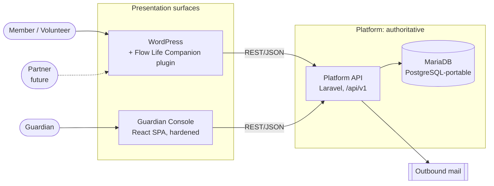

# System context

## Actors and systems



- **Platform API** is the only component that owns organizational data, identity relationships, authorization and business rules.
- **WordPress** renders member and volunteer experiences and forwards user actions to the API. It stores no data of record and its roles never decide access ([WordPress integration](../integrations/wordpress.md)).
- **Guardian Console** is a separately deployed, separately hardened operational client of the same API. It is not a privileged back door: it goes through the same server-side authorization.
- Any future surface (partner portal, mobile app, WordPress replacement) is another client of the API.

## Development topology

Everything runs in Docker Compose behind one gateway; see [Docker environment](../development/docker.md).

```
browser ──► gateway (Caddy, :18080) ─┬─ commons.flowlife.localhost /api/*, /up ─► platform (php-fpm) ─► MariaDB
                                     ├─ commons.flowlife.localhost  everything else ─► Vite dev server (HMR)
                                     └─ mail.flowlife.localhost                    ─► Mailpit
          queue worker + scheduler (dev) ─► MariaDB
```

## Production topology (initial)

Shared cPanel hosting: PHP 8.3 serving the platform, MariaDB 10.11, cron driving the Laravel scheduler (which is intended to drain the database queue too; nothing is scheduled yet), and the Guardian Console as static files built in CI or on a developer machine. No Docker, Node.js, Redis or resident daemons. Deployment is out of scope for the foundation and deliberately not automated yet.
