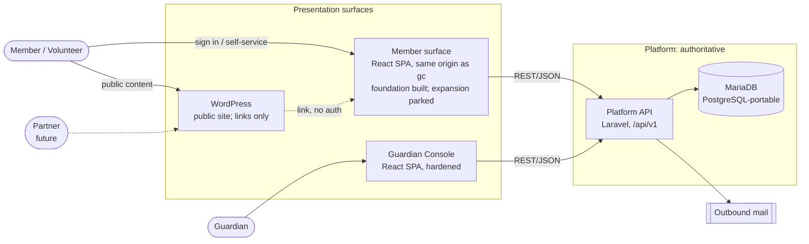

# System context

## Actors and systems


```mermaid
flowchart LR
    member([Member / Volunteer])
    guardian([Guardian])
    partner([Partner<br/>future])

    subgraph surfaces [Presentation surfaces]
        wp[WordPress<br/>public site; links only]
        gc[Guardian Console<br/>React SPA, hardened]
        ms[Member surface<br/>React SPA, same origin as gc<br/>foundation built; expansion parked]
    end

    subgraph core [Platform: authoritative]
        api[Platform API<br/>Laravel, /api/v1]
        db[(MariaDB<br/>PostgreSQL-portable)]
    end

    mail[[Outbound mail]]

    member -- public content --> wp
    member -- sign in / self-service --> ms
    wp -. link, no auth .-> ms
    guardian --> gc
    partner -.-> wp
    ms -- REST/JSON --> api
    gc -- REST/JSON --> api
    api --> db
    api --> mail
```

- **Platform API** is the only component that owns organizational data, identity relationships, authorization and business rules.
- **WordPress** hosts the public site and links a Member into the Commons-hosted member surface. It renders no authenticated member data, forwards no user action to the API, holds no Commons credential and stores no data of record ([WordPress integration](../integrations/wordpress.md), [ADR 0032](../adr/0032-members-use-a-commons-hosted-surface.md)). This differs from WordPress's originally anticipated role; the reasoning is in [member access](member-access.md).
- **The member surface** has its foundation built (`/my/`; [member access](member-access.md)), with further expansion parked: an authenticated self-service area served from the same Commons origin as the Guardian Console, using the same session model, but a distinct application shell and never granting Console access.
- **Guardian Console** is a separately deployed, separately hardened operational client of the same API. It is not a privileged back door: it goes through the same server-side authorization.
- Any future surface (partner portal, mobile app, WordPress replacement) is another client of the API.

## Development topology

Everything runs in Docker Compose behind one gateway; see [Docker environment](../development/docker.md).

```
browser ──► gateway (Caddy, :18080) ─┬─ commons.flowlife.localhost /api/*, /up ─► platform (php-fpm) ─► MariaDB
                                     ├─ commons.flowlife.localhost  everything else ─► Vite dev server (HMR)
                                     └─ mail.flowlife.localhost                    ─► Mailpit
          queue worker + scheduler (dev) ─► MariaDB
```

## Production topology (initial)

Shared cPanel hosting: PHP 8.3 serving the platform, MariaDB 10.11, cron running `php artisan schedule:run` every minute against the deployed release (`commons/current`), and the Guardian Console as static files built off-host and shipped as part of the release artifact. The scheduler is live and in production use: `identity:prune-expired` runs hourly, removing expired transient Identity state (ADR 0016, ADR 0023). The scheduler is also intended to drain the database queue once one exists, but no application code currently dispatches queued work, so there is no queue worker and the `jobs` table is unused. No Docker, Node.js, Redis or resident daemons. **Production is deployed and live** at `commons.flowlifeglobal.org`, first deployed 2026-09-22 as v0.1.1 and currently **v0.3.0** (not every commit on `main` has been released or deployed; [production readiness](../runbooks/production-readiness.md)). Deployment automation is deliberately absent: releases follow a manual, documented procedure ([ADR 0027](../adr/0027-release-and-deployment-model.md)), revisited only after more operational experience.
